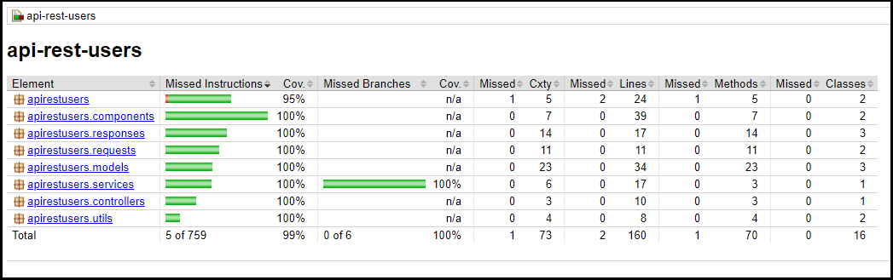
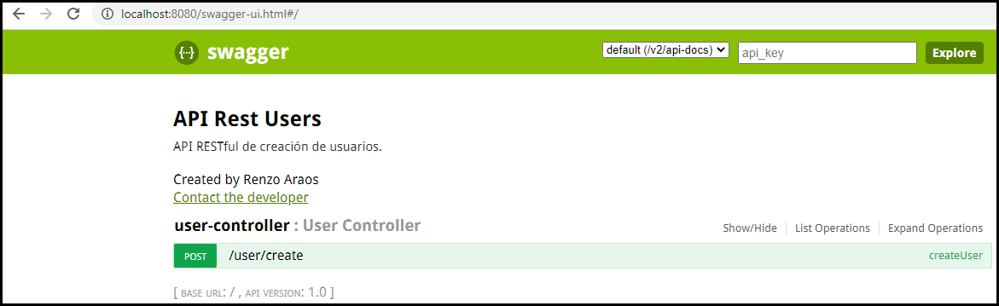
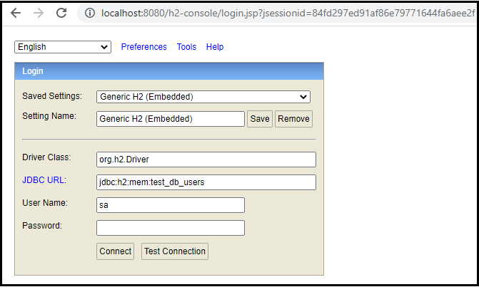
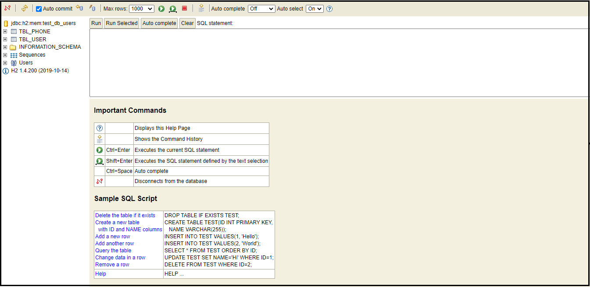

# api-rest-users-demo
Proyecto DEMO de una API Rest de Creación de Usuarios.

### PRIMERA PARTE: 

A continuación, se presenta una serie de pasos para levantar el proyecto.

#### Paso 1: Descargar el proyecto en una consola git bash con el comando git:
#### git clone https://github.com/readarch/api-rest-users-demo.git

#### IMPORTANTE: Debe de tener instalado git en su máquina local


#### Paso 2: En la misma raíz del proyecto, ejecutar en el CLI (Interfaz de linea de comandos de Windows) el comando:
#### gradle bootRun

#### IMPORTANTE: Debe de tener instalado gradle en su máquina local


#### Paso 3: Para la ejecución de las pruebas unitarias con jacoco, ejecutar en el CLI el siguiente comando:
#### gradle jacocoTestReport


#### Paso 4: Luego nos dirigimos a la siguiente ruta dentro de la raíz principal del proyecto
#### /build/reports/jacoco/test/html/index.html dando doble click al archivo index.html



### SEGUNDA PARTE:

A continuación, se presenta una serie de pasos para usar el proyecto.

#### Paso 1: Una vez levantado el proyecto nos dirigimos a la siguiente URL del proyecto
#### http://localhost:8080/swagger-ui.html



#### Paso 2: Ejecutamos el servicio cuyo único endpoint es la creación de usuarios,
#### probando con el siguiente request body
```javascript
{
    "name":"Juan Perez",
        "email":"juan.perez@prueba.com",
        "password":"Prueba26",
        "phones":[
        {
            "citycode":"1",
            "contrycode":"01",
            "number":"111111111"
        },
        {
            "citycode":"2",
            "contrycode":"02",
            "number":"222222222"
        },
        {
            "citycode":"3",
            "contrycode":"03",
            "number":"333333333"
        },
        {
            "citycode":"4",
            "contrycode":"04",
            "number":"444444444"
        }
    ]
}
```


#### Paso 3: Observamos que el servicio se ha ejecutado correctamente respondiendo un HTTP 200
#### y retornando los datos de registro del usuario


#### Paso 4: Ahora ingresamos a la consola de la base de datos H2 cuya URL es
#### http://localhost:8080/h2-console



#### Paso 5: Observándose además que la JDBC URL es:
#### jdbc:h2:mem:test_db_users

#### Nos conectamos con usuario 'sa' y sin contraseña dando clic en el botón "Connect"



#### Paso 6: Realizamos los queries SELECT de las tablas TBL_USER y TBL_PHONE
#### verificando el registro de los datos que ejecutamos previamente en el servicio.

#### Consulta SELECT a la tabla TBL_USER:


#### Consulta SELECT  a la tabla TBL_PHONE:


